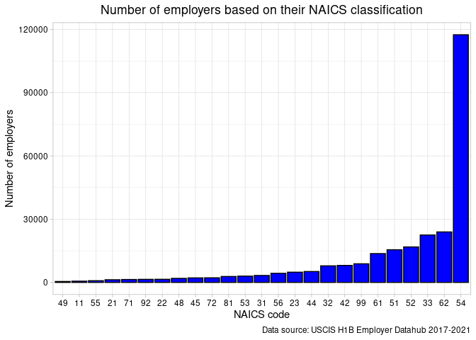

H1b Employer Data Analysis
================
Narender Tumu

## Loading the “H1b\_data.RData” file which was obtained after cleaning the raw data files. For the process of cleaning the data navigate to [Data Cleaning](https://github.com/NarenderTumu/H1B-employer-data-analysis/tree/main/Files/Data%20Cleaning)

**Data Dictionary for the H1B employer data**

<table class="table table-bordered" style="width: auto !important; margin-left: auto; margin-right: auto;">
<thead>
<tr>
<th style="text-align:left;">
Variable
</th>
<th style="text-align:center;">
Description
</th>
<th style="text-align:center;">
Datatype
</th>
</tr>
</thead>
<tbody>
<tr>
<td style="text-align:left;">
ZIP
</td>
<td style="text-align:center;">
Petitioner’s five-digit ZIP code
</td>
<td style="text-align:center;">
character
</td>
</tr>
<tr>
<td style="text-align:left;">
Fiscal\_Year
</td>
<td style="text-align:center;">
This variable indicates the fiscal year in which the H-1B petition was
filed. Fiscal year in the United States starts from October 1st and ends
on September 30th of the following year.
</td>
<td style="text-align:center;">
numeric
</td>
</tr>
<tr>
<td style="text-align:left;">
Employer
</td>
<td style="text-align:center;">
Petitioner’s firm/employer name
</td>
<td style="text-align:center;">
character
</td>
</tr>
<tr>
<td style="text-align:left;">
Initial\_Approvals
</td>
<td style="text-align:center;">
Number of approvals when the employer filing petition for the first time
to the worker
</td>
<td style="text-align:center;">
numeric
</td>
</tr>
<tr>
<td style="text-align:left;">
Initial\_Denials
</td>
<td style="text-align:center;">
Number of denails when the employer filing petition for the first time
to the worker
</td>
<td style="text-align:center;">
numeric
</td>
</tr>
<tr>
<td style="text-align:left;">
Continuing\_Approvals
</td>
<td style="text-align:center;">
Number of approvals when the employer is filing the petition for the
worker who was already having an approved visa for the same employer and
wishing to extend the workers time period
</td>
<td style="text-align:center;">
numeric
</td>
</tr>
<tr>
<td style="text-align:left;">
Continuing\_Denials
</td>
<td style="text-align:center;">
Number of denials when the employer is filing the petition for the
worker who was already having an approved visa for the same employer and
wishing to extend the workers time period
</td>
<td style="text-align:center;">
numeric
</td>
</tr>
<tr>
<td style="text-align:left;">
NAICS
</td>
<td style="text-align:center;">
North American Industry Classification System Code: A character string
that stands for an industry classification within the North American
Industry Classification System,For more information on the NAICS, visit
the [U.S. Census Bureau’s North American Industry Classification Code
webpage](https://www.census.gov/naics/)
</td>
<td style="text-align:center;">
numeric
</td>
</tr>
<tr>
<td style="text-align:left;">
State
</td>
<td style="text-align:center;">
Petitioner’s state
</td>
<td style="text-align:center;">
character
</td>
</tr>
<tr>
<td style="text-align:left;">
City
</td>
<td style="text-align:center;">
Petitioner’s City
</td>
<td style="text-align:center;">
character
</td>
</tr>
<tr>
<td style="text-align:left;">
Total\_population
</td>
<td style="text-align:center;">
Population of the place by Zipcode
</td>
<td style="text-align:center;">
integer
</td>
</tr>
</tbody>
</table>

**The following table provides detailed information on the definitions
of NAICS codes**

<table class="table table-bordered" style="width: auto !important; margin-left: auto; margin-right: auto;">
<thead>
<tr>
<th style="text-align:left;">
Sector
</th>
<th style="text-align:left;">
Definition
</th>
</tr>
</thead>
<tbody>
<tr>
<td style="text-align:left;">
11
</td>
<td style="text-align:left;">
Agriculture, Forestry, Fishing and Hunting
</td>
</tr>
<tr>
<td style="text-align:left;">
21
</td>
<td style="text-align:left;">
Mining, Quarrying, and Oil and Gas Extraction
</td>
</tr>
<tr>
<td style="text-align:left;">
22
</td>
<td style="text-align:left;">
Utilities
</td>
</tr>
<tr>
<td style="text-align:left;">
23
</td>
<td style="text-align:left;">
Construction
</td>
</tr>
<tr>
<td style="text-align:left;">
31-33
</td>
<td style="text-align:left;">
Manufacturing
</td>
</tr>
<tr>
<td style="text-align:left;">
42
</td>
<td style="text-align:left;">
Wholesale Trade
</td>
</tr>
<tr>
<td style="text-align:left;">
44-45
</td>
<td style="text-align:left;">
Retail Trade
</td>
</tr>
<tr>
<td style="text-align:left;">
48-49
</td>
<td style="text-align:left;">
Transportation and Warehousing
</td>
</tr>
<tr>
<td style="text-align:left;">
51
</td>
<td style="text-align:left;">
Information
</td>
</tr>
<tr>
<td style="text-align:left;">
52
</td>
<td style="text-align:left;">
Finance and Insurance
</td>
</tr>
<tr>
<td style="text-align:left;">
53
</td>
<td style="text-align:left;">
Real Estate and Rental and Leasing
</td>
</tr>
<tr>
<td style="text-align:left;">
54
</td>
<td style="text-align:left;">
Professional, Scientific, and Technical Services
</td>
</tr>
<tr>
<td style="text-align:left;">
55
</td>
<td style="text-align:left;">
Management of Companies and Enterprises
</td>
</tr>
<tr>
<td style="text-align:left;">
56
</td>
<td style="text-align:left;">
Administrative and Support and Waste Management and Remediation Services
</td>
</tr>
<tr>
<td style="text-align:left;">
61
</td>
<td style="text-align:left;">
Educational Services
</td>
</tr>
<tr>
<td style="text-align:left;">
62
</td>
<td style="text-align:left;">
Health Care and Social Assistance
</td>
</tr>
<tr>
<td style="text-align:left;">
71
</td>
<td style="text-align:left;">
Arts, Entertainment, and Recreation
</td>
</tr>
<tr>
<td style="text-align:left;">
72
</td>
<td style="text-align:left;">
Accommodation and Food Services
</td>
</tr>
<tr>
<td style="text-align:left;">
81
</td>
<td style="text-align:left;">
Other Services (except Public Administration)
</td>
</tr>
<tr>
<td style="text-align:left;">
92
</td>
<td style="text-align:left;">
Public Administration
</td>
</tr>
<tr>
<td style="text-align:left;">
99
</td>
<td style="text-align:left;">
Unknown
</td>
</tr>
</tbody>
</table>

we have variables that are numeric, character and integer. Let’s convert
some of the variable to use them for analysis

``` r
# converting the Fiscal_Year, NAICS variables from numeric to factor

H1b_data$Fiscal_Year<-as.factor(H1b_data$Fiscal_Year)

H1b_data$NAICS<-as.factor(H1b_data$NAICS)


# converting the State, City variables from Charatcer to factor

H1b_data$State<-as.factor(H1b_data$State)

H1b_data$City<-as.factor(H1b_data$City)
```

Checking the Summmary statistics of all the numeric variables in the
dataset using select() and summary() functions

    ##  Initial_Approvals  Initial_Denials     Continuing_Approvals Continuing_Denials
    ##  Min.   :   0.000   Min.   :   0.0000   Min.   :    0.000    Min.   :   0.000  
    ##  1st Qu.:   0.000   1st Qu.:   0.0000   1st Qu.:    0.000    1st Qu.:   0.000  
    ##  Median :   0.000   Median :   0.0000   Median :    1.000    Median :   0.000  
    ##  Mean   :   2.035   Mean   :   0.3708   Mean   :    5.041    Mean   :   0.406  
    ##  3rd Qu.:   1.000   3rd Qu.:   0.0000   3rd Qu.:    2.000    3rd Qu.:   0.000  
    ##  Max.   :4807.000   Max.   :2060.0000   Max.   :26145.000    Max.   :3910.000  
    ##                                                                                
    ##  Total_population
    ##  Min.   :     0  
    ##  1st Qu.: 16845  
    ##  Median : 28234  
    ##  Mean   : 30459  
    ##  3rd Qu.: 41411  
    ##  Max.   :130352  
    ##  NA's   :28

### Using the table() function for all the factor variables to get the frequency distribution of each level

### We can see that from the below plot, most of the employers belongs to Professional, Scientific, and Technical Services category

<!-- -->

``` r
H1b_data$Initial_Approvals<-H1b_data$Initial_Approvals+1
H1b_data$Continuing_Approvals<-H1b_data$Continuing_Approvals+1
```

``` r
#model<-lm(log(Initial_Approvals)~log(Continuing_Approvals),data = H1b_data)
#summary(model)
```

``` r
#plot(model)
```
